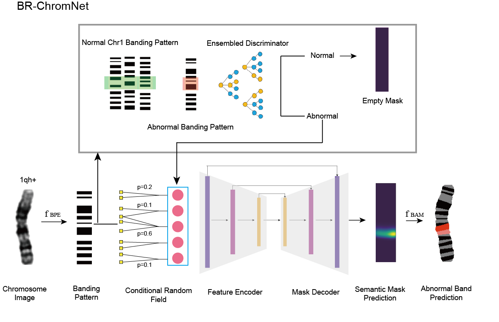

## Introduction
This is the program implementation of the paper: [BR-ChromNet: Banding Resolution Localization of Chromosome Structural Abnormality with Conditional Random Field](https://doi.org/10.1016/j.jmb.2024.168733)
You can reproduce our results using this repo.


## Overall Framework of BRChromNet
<div align="center">
    
</div>

## Environment
The code is developed using python 3.8. CUDA version is set to be 11.4. NVIDIA GPUs are needed. The code is developed and tested using 2 NVIDIA TITAN GPU cards. Other platforms or GPU cards are not fully tested.

Make sure to create the virtual environment by setting:

```
conda create -n BRchromnet python=3.8
source activate BRchromnet
```

To install required packages, please run the following:

```
pip install -r requirements.txt
```

## Dataset
In this repo, we only provide sample dataset for 3 kinds of abnormal karyotypes (1qh+, 9qh+, inv9(p12q13)). The "data" folder contain original image (.png) along with human annotated mask(.npy) for abnormal region.
The data utilized in this study is private and will be made available upon reasonable request for non-commercia use. We are dedicated to promoting transparency in our research while also safeguarding privacy.  
```
├── 1qh+
│ ├── abnormal
│ │ ├── B17-0082_chr1_B.npy
│ │ ├── B17-0082_chr1_B.png
│ │ ├── ...
│ └── normal
│     ├── AF17-1085.106.K_chr1_A.npy
│     ├── AF17-1085.106.K_chr1_A.png
│     ├── ...
├── 9qh+
├── inv9_p12q13
```

## Inference

The trained model weights are available in the folder ``model`` and ``weight`` from [Google Drive](https://drive.google.com/drive/folders/1jCZ4Hli_VrmTPUlwx-DBc5lHt87hwZyF?usp=sharing)


```
python inference.py
```

## Visualization
see visualization.ipynb

## Reference
Code for banding patter extraction is sourced from
[*Uzolas, Lukas, et al Deep anomaly generation: An image translation approach of synthesizing abnormal banded chromosome images.*](https://github.com/lukasuz/Banding-Pattern-Extraction).


## Citation

If you use our code or models in your research, please cite upon publication:
```
@article{chen2024br,
  title={BR-ChromNet: Banding resolution localization of chromosome structural abnormality with conditional random field},
  author={Chen, Siyuan and Hu, Tingting and Li, Na and Gao, Xin and Yu, Yongguo},
  journal={Journal of Molecular Biology},
  volume={436},
  number={20},
  pages={168733},
  year={2024},
  publisher={Elsevier}
}
```
